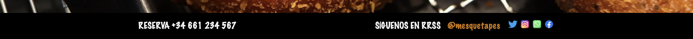

# proyecto-final-carta-restaurante
Proyecto final de la formación previa al Bootcamp Full Stack Developer de la academia GeeksHubs.

# Carta restaurante
##### @ladronbx

## Descripción
* Diseño de una pagina web con temática de restauracion. 
* Tratando de realizar una web responsive, que se adapte tanto a pantalla de PC como a pantalla de smartphone. 
* Diseño inspirado en el minimalismo, obteniendo ideas de la famosa cadena de restaurante The Fitzerald.

## Vista previa Home

## Estructura de la página web

* La web se compone de un total de cinco secciones. Ubicado de forma fija al realizar scroll en la parte superior, nos encontramos el nombre del restaurante **Mesquetapes**, y al clickar sobre él nos llevará siempre a la **página principal**. Debajo del nombre del restaurante, a modo de menú y también de forma fija, nos encontramos las diferente secciones por las que podemos navegar: **TAPAS**, **CREPES**, **BEBIDAS** y **POSTRES**. También podemos observar que al pasar el mouse por encima de los elementos del menú, éstos, cambian de color.

## Diseño responsive
* Al seleccionar cualquier elemento del menú **TAPAS**, **CREPES**, **BEBIDAS** o **POSTRES** se puede observar que en vista de escritorio los productos se encontrarán alineados en filas de 4 elementos. Mientras que si vamos disminuyendo el tamaño del display, observamos que se apilan en filas de dos o incluso de uno en uno cuando se observa desde un smartphone. 

/* Insertar imágenes */

* En el footer se oberva, de forma fija también al realizar scroll, en la izquierda el número de teléfono ficticio del establecimiento para poder **reservar**. Y a la derecha información de **Redes Sociales** para poder contactar. Los iconos de las páginas webs al ser ficticios al clickar no lleva a ninguna web externa.

/* Insertar imágenes */
/* Insertar imágenes */

## Desarrollado con :
* [HTML5](https://lenguajehtml.com/html/)
* [CSS3](https://desarrolloweb.com/manuales/css3.html)
* [Bootstrap](https://getbootstrap.com/)

## Licencia y Copyright
* Todas las imágenes de alimentos y bebidas son sin licencia de copyright.
* Imágenes extraidas de : [Pixabay](https://pixabay.com/es/) y [Pexels](https://www.pexels.com/es-es/)